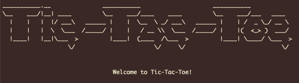

 

  

  <h3 align="center">Tic-Tac-Toe Game</h3>

  

    This project is part of the Microverse Ruby Module.
     
    <a href="https://github.com/chuckbuckethead/microverse-tic-tac-toe/issues">Report Bug</a>
    ·
    <a href="https://github.com/chuckbuckethead/microverse-tic-tac-toe/issues">Request Feature</a>
  

## About the game

The tic-tac-toe game is a two person game in which the players, X and O, take turns choosing available positions in a 3×3 grid.
The player who succeeds in placing three of his marks in a diagonal, horizontal, or vertical row is the winner.
For example:

| X 	|  	|  	|
|-	|-	|-	|
| O 	| X 	|
| O 	|  	| X 	|

In this example, the player who marked the empty spaces with an X won the game.

## How to run the game

### Prerequisites

The game is written in Ruby, so in order to play it you should:
1. have Ruby (v2.7.0 or newer) installed in your machine.
1. download and uncompress the code
1. go to the folder where you uncompressed the code and run this command: bin/main.rb (you must make sure that you have both /lib and /bin folders after uncompression)

### With the game running:

* the first player introduces the desired nick-name (only non-empty nick-names are allwed) and immediatly is asked to choose a mark: X or O
* the second player is asked to introduce a nick-name and will use the mark not chosen by the first player
* every space in the board is a "position", and they are numbered this way:

| 1 	| 2 	| 3 	|
|-	|-	|-	|
| 4 	| 5 	| 6 	|
| 7 	| 8 	| 9 	|

* taking this order into account, players will take turns to choose an available position in the board
* the game can finish with a winner or in a draw

## Built With

- Ruby
- RubyMine

## Authors

👤  **Carlos González**
- GitHub: [@chuckbuckethead](https://github.com/chuckbuckethead)
- Twitter: [@aclerkofpomier](https://twitter.com/aclerkofpomier)
- LinkedIn: [Carlos González](https://www.linkedin.com/in/chuckbuckethead/)

👤  **Miguel Gómez**
- GitHub: [@MiguelArgentina](https://github.com/MiguelArgentina)
- Twitter - [@Qete_arg](https://twitter.com/Qete_arg)
- LinkedIn: [Miguel Gómez](https://www.linkedin.com/in/miguelricardogomez/)

## 🤝 Contributing

Contributions, issues, and feature requests are welcome!

Feel free to check the [issues page](https://github.com/chuckbuckethead/microverse-tic-tac-toe/issues).

## Show your support

Give a ⭐️ if you like this project!

## 📝 License

This project is [MIT](https://www.mit.edu/~amini/LICENSE.md) licensed.
